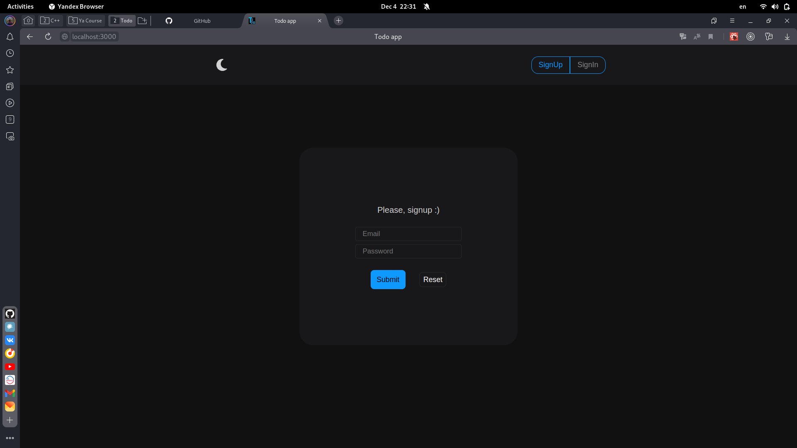
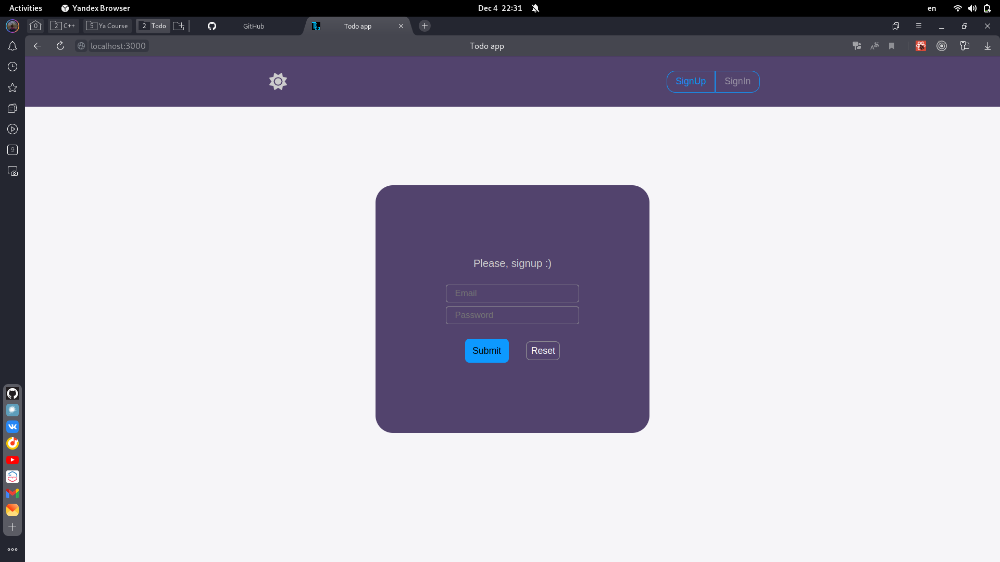
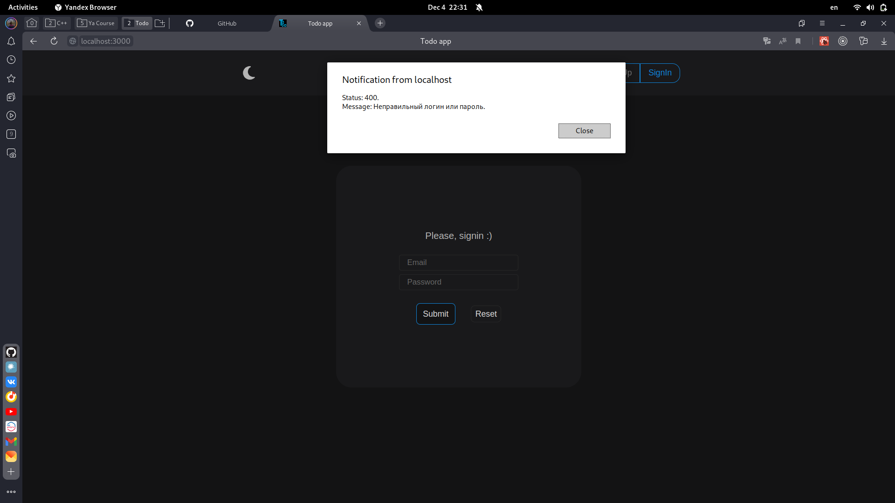
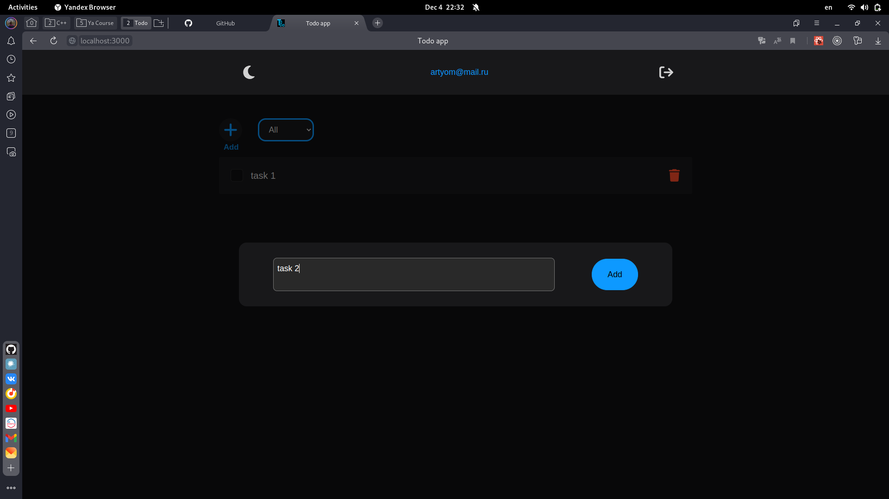
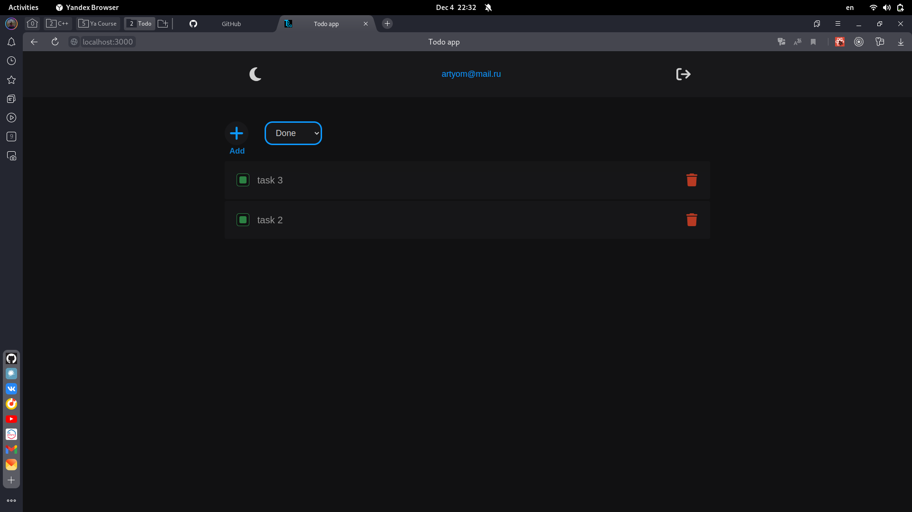
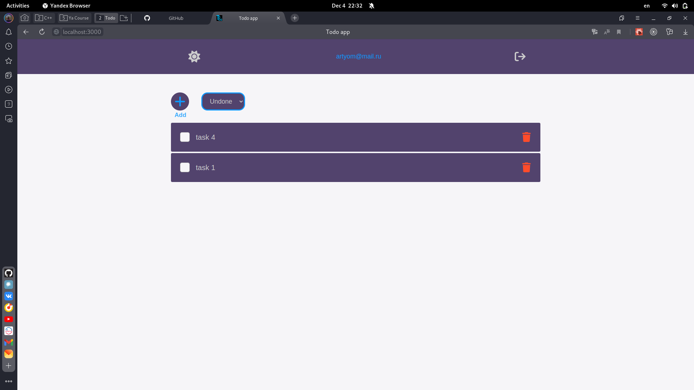
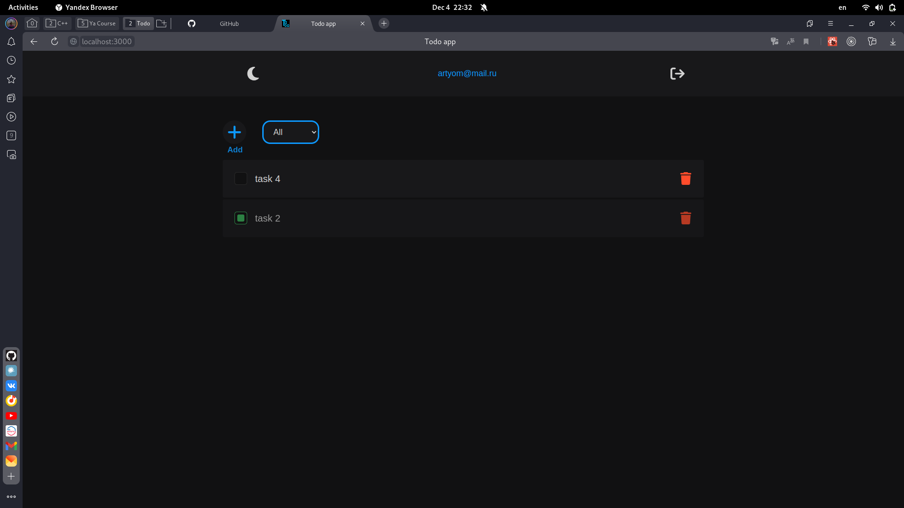

# todo

## Тестовое задание на позицию junior frontend разработчика.

- [Представление](#представление)
- [Замечания](#замечания)

---

### Представление

**Рис.1 Авторизация темная тема**

**Рис.2 Авторизация светлая тема**

**Рис.3 Ошибка**

**Рис.4 Добавление задачи**

**Рис.5 Список выполненных задач**

**Рис.6 Список невыполненных в светлой теме**

**Рис.7 Удалённые задачи**

---

### Замечания

**Несколько пунктов, которые я бы хотел исправить или добавить:**

- **Ошибки**
  - Добавить мидлвары на проверку авторизации (и последующем мутировании запроса данными пользователя user из куков)
  - Добавить мидлвар после роутов на отправку ошибок (РЕШЕНО В ОТДЕЛЬНОЙ ВЕТКЕ).
  - Заменить заглушку alert для ошибки на ErrorBoundary
  - В общем отрефакторить data-flow ошибок (несколько раз передумывал делать, в итоге получилось не очень)
- **Компоненты**
  - Отрефакторить некоторые "уродливые" компоненты (как в логике, так и в стилях)
  - Добавить HOC для провайдеров
- **Стили**
  - Добавить больше переменных, миксинов (размеры и т.д.)
- **Авторизация**
  - Метод signout не разлогинивает пользователя на стороне сервера (РЕШЕНО В ОТДЕЛЬНОЙ ВЕТКЕ).
  
Эти недочёты я определил на первый взгляд. Решённые в отдельной ветке недочёты объединю после ответа на тестовое, чтобы по-честному :)
